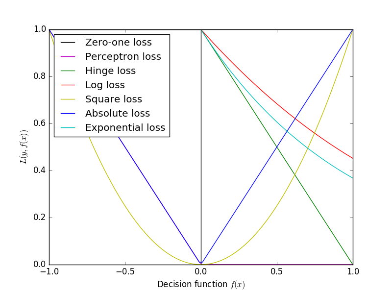

## Learning and search methods

### Problem 1
Q: What is the loss function? Give three examples (Least Square,
Logistic, Hinge) and describe their shapes and behaviors.

A loss function or cost function is a function that maps an event or
values of one or more variables onto a real number intuitively
representing some "cost" associated with the event.

$$w^*=\arg\min_{w}\sum L(y_i,f(x_i;w))+\lambda\Omega(w)$$

Here $L(y_i,f(x_i;w))$ is the loss function,
$\Omega(w)$ is the regularization function.

#### Least Square

$$L(y_i,f(x_i;w))=(y_i-f(x_i;w))^2$$

#### Logistic

$$L(y_i,f(x_i;w))=\log(1+\exp(-y_i\cdot f(x_i;w)))$$

#### Hinge

$$L(y_i,f(x_i;w))=\max\{0,1-y_i\cdot f(x_i;w)\}$$

### Problem 2
Q: Using these losses to approach the actual linear boundary,
inevitably some risks will be incurred; give two different approaches
to remedy the risk using SVM-based hinge loss as an example.

We often use L1 norm ($\lambda\|\|w\|\|_1$) or L2 norm
($\frac{1}{2}\|\|w\|\|_2$) as regularization function
to avoid structural risk.

### Problem 3
Q: How many possible models are there given a set of training data?
What is the key assumption of PAC learning for model selection?

There are infinite possible models.

Probably Approximately Correct (PAC) learning is a framework
for mathematical analysis of machine learning. The goal is that,
with high probability (the "probably" part), the selected function will
have low generalization error (the "approximately correct" part).

### Problem 4
Q: Describe biases and variance issue in learning, and how can we
select and validate an appropriate model?

#### Bias
The bias is an error from erroneous assumptions in the learning algorithm.
High bias can cause an algorithm to miss the relevant relations between
features and target outputs (underfitting).

#### Variance
The variance is an error from sensitivity to small fluctuations in the
training set. High variance can cause an algorithm to model the random
noise in the training data, rather than the intended outputs (overfitting).

We should select when the total error of biases and variances is lowest.

### Problem 5
Q: How to control model complexity in linear and logistic regression?

Linear regression: when (bias)^2+variance is min

Logistic regression:

### Problem 6
Q: Using the Least Sqaure as the objective function, we try to find the
best set of parameters; what is the statistical justification if the
underlying distribution is Gaussian?

### Problem 7
Q: What does the convexity means in either Least Square-based regression
or Likelihood-based estimation?

### Problem 8
Q: Gradient Decent has a number of different implementations, including
SMO, stochastic methods, as well as a more aggressive Newton method,
what are some if the key issues when using any Gradient-based searching
algorithm?

### Problem 9
Q: What are the five key problems whenever we are talking about modeling
(Existence, Uniqueness, Convexity, Generalizability)? Why they are so
important?

### Problem 10
Q: Give a probabilistic interpretation for logistic regression? How is
it related to the MLE-based generative methods?

### Problem 11
Q: Compare the generative and discriminative methods?

### Problem 12
Q: For the regular and multinomial Naïve Bayes, what are their key
assumptions? ~~Why the multinomial methos can be more context sensitive?~~

### Problem 13
Q: What are the key advantages of linear models? What are the key problems
with the complex Neural Network?

### Problem 14
Q: What are three alternatives to approach a constrained maximization problem?

### Problem 15
Q: What is the dual problem? What is strong duality?

### Problem 16
Q: What are the KKT conditions? What is the key implication of them?
Including the origin of SV?

### Problem 17
Q: What is the ideal of soft margin SVM, how is it a nice example of
regularization?

### Problem 18
Q: The idea of kernel? Why not much additional computational complexity?

### Problem 19
Q: What is the general idea behind the kernel? What key computation do
we perform? Why is it so general in data modeling?

### Problem 20
Q: Why we often want to project a distance "measure" to a different space?

